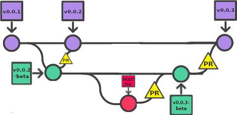

# Who does what
## Workflow

  

    <b><i>AMR Workflow</b></i>
  

### Beta Branch
:warning: :fire: **To deploy a new pre-release make sure the targeted version is higher than both the current `beta` and `main` branch version.**

- Pushing commits and merges
  - CI won't run tests
  - Deploy a pre-release if package.json version is incremented
- Submit PR
  - CI will run tests to check pull request
- Accept PR
  - Changes are merged
  - Deploy a pre-release if package.json version is incremented
### Main Branch
:warning: :fire: **This branch must be updated through PRs <u>from beta branch AND the same repo</u> only**, not doing this could results in tons of conflict between both branches

- Pushing commits and merges
  - :shit: DON'T!
- Accept/Submit PR from a fork
  - :shit: DON'T!
- Submit PR from [JiPaix/beta](https://github.com/JiPaix/AMR/tree/beta) to [JiPaix/main](https://github.com/JiPaix/AMR/tree/main)
  - Ci will run tests to check pull requests
- Accept PR from [JiPaix/beta](https://github.com/JiPaix/AMR/tree/beta) to [JiPaix/main](https://github.com/JiPaix/AMR/tree/main)
  - Changes are merged
  - Deploy a pre-release if package.json version is incremented
  - Beta branch is updated (fast-forward) to include merge commit

  

    <b><i>CI: explaining Github Actions</b></i>
  

#### lint.yml
- Description: Linting
- Trigger: PRs (main/beta)
- Actions:
  - Runs: `eslint . --ext js,ts,vue`

#### release.yml
- Description: Release new version
- Trigger: Pushes (main)
- Actions:
  - Check if target version in package.json is `!=` from current version
  - Generate changelog using `.github/actions/release-notes/main.js`
  - Remove outdated draft releases
  - Create new Draft releases
  - Build and upload artifacts (windows and linux)
  - Publish release
  - Fast forward beta branch

#### release-beta.yml
- Description: Release new version
- Trigger: Pushes (beta)
- Actions:
  - Check if target version in package.json is `!=` from current version
  - Add `-beta` suffix to target version
  - Generate changelog using `.github/actions/release-notes/main.js`
  - Remove outdated draft prereleases
  - Create new Draft prereleases
  - Build and upload artifacts (windows and linux)
  - Publish prerelease

#### tests.yml
- Description: Test the Application
- Trigger: PRs (main/beta)
- Actions:
  - Test the Electron process `main` 
  - Test the Electron preloader `preload` 
  - Test Vue components `renderer`
  - End-To-End testing `e2e`
#### typechecking.yml
- Description: TypeScript testing
- Trigger: PRs (main/beta)
- Actions:
  - runs typecheck on `main`, `preload` and `renderer`

#### update-electron-vendors.yml
- Description: Check if Electron's chrome version has updated. Used in builds.
- Trigger: Pushes, if package.json has been updated
- Actions:
  - update `.electron-vendors.cache.json` file

## Tests

  

    <b><i>Main</b></i>
  

`packages/main/tests/unit.spec.ts`

This files test the electron BrowserWindow API itself.  
Included tests:
- Create window
- Minimize/Maximize window
- Destroy window

  

    <b><i>Preload</b></i>
  

`packages/preload/tests/unit.spec.ts`

This files test if libraries exposed to the renderer are working.  
Included tests:
- Test `createHash` from `crypto`

  

    <b><i>Renderer</b></i>
  

`packages/preload/tests/ReactiveHash.spec.ts`

Test the `ReactiveHash` Vue component:
- Setup a `string` and it's `hash`
- Give `string` to component `input`
- Take the hashing result from component `output`
- check if `output` === `hash`

`packages/preload/tests/ReactiveStore.spec.ts`

Test the `ReactiveStore` Vue component:
- Setup a `string`
- Check if component `output` loads with its default value
- `click` first button and check if `output` has changed
- Give `string` to `input` and check if `output` === `string`

## Builds

  

    <b><i>Main and Preload</b></i>
  

Nothing special there, its pretty basic:
- each package have aliases that match their relative path `/@/`
- use `.electron-bendors.cache.json` as node target
- include devtools
- minify files on production

  

    <b><i>Renderer</b></i>
  

- alias that match relative path `/@/`
- use `.electron-bendors.cache.json` as chrome target
- minify files on production
- library declaration files that describe the target runtime environment: `ESNEXT`, `dom`, `dom.iterable`
- test environment uses `happy-dom`

